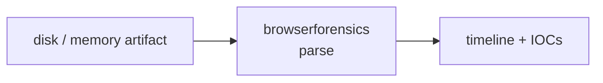

<a name="top"></a>
<div align="center">


# BROWSERFORENSICS

### Analyze exported browser history/downloads for IOCs and exfil signs


[](https://pypi.org/project/cognis-browserforensics/) [](https://github.com/cognis-digital/browserforensics/actions) [](LICENSE) [](https://github.com/cognis-digital)

*Part of the Cognis Neural Suite.*

</div>

```bash
pip install cognis-browserforensics
browserforensics scan .            # → prioritized findings in seconds
```

## Usage — step by step

`browserforensics` performs defensive IOC / exfil triage on exported browser history and downloads.

1. **Install**:
   ```bash
   pip install -e .
   ```
2. **Scan** exported history and/or downloads (CSV or JSON):
   ```bash
   browserforensics scan --history history.csv --downloads downloads.csv
   ```
3. **Write an HTML report** to a file:
   ```bash
   browserforensics scan --history history.json --format html -o triage.html
   ```
4. **Read the output** as JSON for a SIEM/pipeline:
   ```bash
   browserforensics scan --history history.csv --format json -o iocs.json
   ```
5. **Automate in CI/IR runbooks** — `--fail-on` sets the severity that triggers a non-zero exit:
   ```bash
   browserforensics scan --history history.csv --downloads downloads.csv --fail-on high
   ```
6. **Emit SARIF** for GitHub code-scanning / IDE viewers:
   ```bash
   browserforensics scan --downloads downloads.csv --format sarif -o triage.sarif
   ```

### Output formats

`--format table` (default) · `json` (SIEM/pipelines) · `html` (shareable report) · `sarif` (SARIF 2.1.0 for GitHub code-scanning and IDE viewers).

## Contents

- [Why browserforensics?](#why) · [Features](#features) · [Quick start](#quick-start) · [Example](#example) · [Demos](#demos) · [Architecture](#architecture) · [AI stack](#ai-stack) · [How it compares](#how-it-compares) · [Integrations](#integrations) · [Install anywhere](#install-anywhere) · [Related](#related) · [Contributing](#contributing)

<a name="why"></a>
## Why browserforensics?

Analyze exported browser history/downloads for IOCs and exfil signs — without standing up heavyweight infrastructure.

`browserforensics` is single-purpose, scriptable, and self-hostable: point it at a target, get prioritized results in the format your workflow already speaks (table · JSON · SARIF), gate CI on it, and let agents drive it over MCP.

<div align="right"><a href="#top">↑ back to top</a></div>

<a name="features"></a>
## Features

- ✅ Parse Chrome/Firefox **history & downloads** exports (CSV or JSON, auto-detected, column-alias tolerant)
- ✅ ~15 IOC / exfil heuristics: raw-IP hosts, anonymous file-shares, URL shorteners, abused TLDs, double-extension lures, browser-flagged downloads, encoded-query beacons, bulk-transfer & multi-exfil patterns
- ✅ Output as **table · JSON · HTML report · SARIF 2.1.0**
- ✅ `--fail-on <severity>` CI gate with non-zero exit codes
- ✅ 8 verified real-use-case [demos](#demos)
- ✅ Runs on Linux/macOS/Windows · Docker · devcontainer
- ✅ Ports in Python, JavaScript, Go, and Rust (`ports/`)

<div align="right"><a href="#top">↑ back to top</a></div>

<a name="quick-start"></a>
## Quick start

```bash
pip install cognis-browserforensics
browserforensics --version
browserforensics scan .                       # scan current project
browserforensics scan . --format json         # machine-readable
browserforensics scan . --fail-on high        # CI gate (non-zero exit)
```

<div align="right"><a href="#top">↑ back to top</a></div>

<a name="example"></a>
## Example

```text
$ browserforensics scan .
  [HIGH    ] BRO-001  example finding             (./src/app.py)
  [MEDIUM  ] BRO-002  another signal              (./config.yaml)

  2 findings · risk score 5 · 38ms
```

<div align="right"><a href="#top">↑ back to top</a></div>

<a name="demos"></a>
## Demos — real-use-case scenarios

Each folder under [`demos/`](demos/) is a self-contained scenario: a realistic
input file **in the tool's real export format** (Chrome/Firefox history &
downloads, CSV or JSON) plus a `SCENARIO.md` narrative — where the data came
from, the exact command to run, what to expect, and how to act. Every demo is
verified in CI to actually produce (or, for the clean baseline, *not* produce)
the findings it documents.

| Demo | Format | Scenario | Key rules exercised |
|---|---|---|---|
| [`01-basic`](demos/01-basic/) | JSON + CSV | Suspected workstation compromise (mixed IOCs) | many |
| [`02-clean-baseline`](demos/02-clean-baseline/) | JSON | Known-good profile — **zero findings, exit 0** | *(none)* |
| [`03-firefox-csv`](demos/03-firefox-csv/) | CSV (Firefox column names) | Payload hidden among real installers | `download.executable`, `download.from_exfil_host`, `download.browser_flagged` |
| [`04-double-extension-lure`](demos/04-double-extension-lure/) | CSV | Phishing double-extension lures (`invoice.pdf.exe`) | `download.double_extension` |
| [`05-c2-beacon-history`](demos/05-c2-beacon-history/) | JSON | C2 beaconing to a raw-IP `gate.php` | `history.ip_literal_host`, `history.encoded_query`, `history.suspicious_tld` |
| [`06-cloud-bulk-exfil`](demos/06-cloud-bulk-exfil/) | JSON + CSV | Insider bulk export to anonymous file-shares | `history.multi_exfil_pattern`, `download.large_transfer`, `history.sensitive_keyword` |
| [`07-malvertising-shortener`](demos/07-malvertising-shortener/) | CSV | Malvertising shortener → abused-TLD → raw-IP chain | `history.url_shortener`, `history.suspicious_tld`, `history.ip_literal_host` |
| [`08-zip-tld-phish`](demos/08-zip-tld-phish/) | JSON | `.zip` / `.mov` TLD confusion trick | `history.suspicious_tld` |
| [`09-flat-json-array`](demos/09-flat-json-array/) | JSON (flat array) | Linux dev box, staged dropper → loader → stage2 | `download.executable`, `download.from_exfil_host`, `download.from_ip` |

```bash
# e.g. run the insider-exfil scenario across both artifacts
python -m browserforensics scan \
    --history demos/06-cloud-bulk-exfil/history.json \
    --downloads demos/06-cloud-bulk-exfil/downloads.csv
```

> All indicators in the demos are synthetic-but-plausible (documented IP ranges,
> known abused TLDs, public file-share hostnames). No real malware hashes, CVEs,
> or fingerprints are fabricated.

<div align="right"><a href="#top">↑ back to top</a></div>

<a name="architecture"></a>
## Architecture



<div align="right"><a href="#top">↑ back to top</a></div>

<a name="ai-stack"></a>
## Use it from any AI stack

`browserforensics` is interoperable with every popular way of using AI:

- **MCP server** — `browserforensics mcp` (Claude Desktop, Cursor, Cognis.Studio, [uncensored-fleet](https://github.com/cognis-digital/uncensored-fleet))
- **OpenAI-compatible / JSON** — pipe `browserforensics scan . --format json` into any agent or LLM
- **LangChain · CrewAI · AutoGen · LlamaIndex** — wrap the CLI/JSON as a tool in one line
- **CI / scripts** — exit codes + SARIF for non-AI pipelines

<div align="right"><a href="#top">↑ back to top</a></div>

<a name="how-it-compares"></a>
## How it compares

| | **Cognis browserforensics** | typical tools |
|---|:---:|:---:|
| Self-hostable, no account | ✅ | varies |
| Single command, zero config | ✅ | ⚠️ |
| JSON + SARIF for CI | ✅ | varies |
| MCP-native (AI agents) | ✅ | ❌ |
| Polyglot ports (JS/Go/Rust) | ✅ | ❌ |
| Open license | ✅ COCL | varies |
<div align="right"><a href="#top">↑ back to top</a></div>

<a name="integrations"></a>
## Integrations

Pipes into your stack: **SARIF** for code-scanning, **JSON** for anything, an **MCP server** (`browserforensics mcp`) for AI agents, and a webhook forwarder for SIEM/Slack/Jira. See [`docs/INTEGRATIONS.md`](docs/INTEGRATIONS.md).

<div align="right"><a href="#top">↑ back to top</a></div>

<a name="install-anywhere"></a>
## Install — every way, every platform

```bash
pip install "git+https://github.com/cognis-digital/browserforensics.git"    # pip (works today)
pipx install "git+https://github.com/cognis-digital/browserforensics.git"   # isolated CLI
uv tool install "git+https://github.com/cognis-digital/browserforensics.git" # uv
pip install cognis-browserforensics                                          # PyPI (when published)
docker run --rm ghcr.io/cognis-digital/browserforensics:latest --help        # Docker
brew install cognis-digital/tap/browserforensics                             # Homebrew tap
curl -fsSL https://raw.githubusercontent.com/cognis-digital/browserforensics/main/install.sh | sh
```

| Linux | macOS | Windows | Docker | Cloud |
|---|---|---|---|---|
| `scripts/setup-linux.sh` | `scripts/setup-macos.sh` | `scripts/setup-windows.ps1` | `docker run ghcr.io/cognis-digital/browserforensics` | [DEPLOY.md](docs/DEPLOY.md) (AWS/Azure/GCP/k8s) |

<div align="right"><a href="#top">↑ back to top</a></div>

<a name="related"></a>
## Related Cognis tools


**Explore the suite →** [🗂️ all 170+ tools](https://github.com/cognis-digital/cognis-neural-suite) · [⭐ awesome-cognis](https://github.com/cognis-digital/awesome-cognis) · [🔗 cognis-sources](https://github.com/cognis-digital/cognis-sources) · [🤖 uncensored-fleet](https://github.com/cognis-digital/uncensored-fleet) · [🧠 engram](https://github.com/cognis-digital/engram)

<div align="right"><a href="#top">↑ back to top</a></div>

<a name="contributing"></a>
## Contributing

PRs, new rules, and demo scenarios are welcome under the collaboration-pull model — see [CONTRIBUTING.md](CONTRIBUTING.md) and [SECURITY.md](SECURITY.md).

> ### ⭐ If `browserforensics` saved you time, **star it** — it genuinely helps others find it.

## Interoperability

`{}` composes with the 300+ tool Cognis suite — JSON in/out and a shared
OpenAI-compatible `/v1` backbone. See **[INTEROP.md](INTEROP.md)** for the
suite map, composition patterns, and reference stacks.

## License

Source-available under the **Cognis Open Collaboration License (COCL) v1.0** — free for personal, internal-evaluation, research, and educational use; **commercial / production use requires a license** (licensing@cognis.digital). See [LICENSE](LICENSE).

---

<div align="center"><sub><b><a href="https://cognis.digital">Cognis Digital</a></b> · one of 170+ tools in the <a href="https://github.com/cognis-digital/cognis-neural-suite">Cognis Neural Suite</a> · <i>Making Tomorrow Better Today</i></sub></div>
